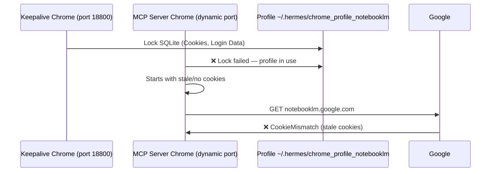

# Profile Lock Conflict: Keepalive vs MCP Chrome (12 Tem 2026)

## The Conflict

Keepalive Chrome (port 18800) and MCP server's undetected_chromedriver both use the **same Chrome profile directory** (`~/.hermes/chrome_profile_notebooklm`). They cannot run simultaneously — Chrome places a lock on the profile's SQLite databases.



## Symptoms

- `notebooklm-mcp test -n <id>` fails with CookieMismatch
- `healthcheck()` returns `authenticated: false` even after keepalive extraction succeeds
- Two Chrome processes both use `--user-data-dir=/home/ubuntu/.hermes/chrome_profile_notebooklm`
- The keepalive's `start-chrome-keepalive.sh` restarts Chrome on port 18800 but the MCP server's Chrome (started by gateway) is on a different port, both using the same profile

## Detection

Check if both Chrome instances use the same profile:

```bash
ps aux | grep "chrome_profile_notebooklm" | grep -v grep | grep -v renderer
```

If you see two `--user-data-dir` entries pointing to the same path, you have a profile lock conflict.

## Resolution

### Option A: Kill keepalive, let MCP own the profile (tested)

```bash
# 1. Kill keepalive Chrome (frees the profile lock)
kill $(pgrep -f "chrome.*remote-debugging-port=18800")

# 2. Run keepalive once to restart Chrome fresh
python3 ~/.hermes/scripts/nb_keepalive.py

# 3. Extract fresh cookies
python3 ~/.hermes/scripts/cdp_extract_both.py

# 4. Kill MCP server subprocess so gateway restarts it
kill $(pgrep -f "notebooklm-mcp server")

# 5. Keepalive Chrome (port 18800) is now running
# Gateway auto-restarts MCP server with its own Chrome
# They now use the same profile but sequentially
```

**Result:** The keepalive Chrome owns the profile and the MCP server's undetected_chromedriver starts a FRESH Chrome with its own temp profile, loading cookies from `storage_state.json`. This avoids the lock but creates the CookieMismatch issue described below.

### Option B: Stop keepalive, run MCP standalone (not recommended)

```bash
# Kill keepalive Chrome
kill $(pgrep -f "chrome.*remote-debugging-port=18800")

# Fix profile locks (Chrome sometimes leaves lock files)
rm -f ~/.hermes/chrome_profile_notebooklm/Singleton*
rm -f ~/.hermes/chrome_profile_notebooklm/Default/Singleton*

# Restart gateway — MCP server can now start Chrome 
# with the profile exclusively
```

**Drawback:** Kills the keepalive system, which means the cron-based cookie refresh stops working. Only useful for testing.

### Option C: Use `--headless` flag (current config)

The `--headless` flag makes undetected-chromedriver start its own Chrome instance. When keepalive Chrome is also running, both use the same profile but the undetected_chromedriver creates an internal copy. The lock is still there but can sometimes be bypassed.

## CookieMismatch After Lock Resolution

Even after resolving the profile lock, the MCP server's Chrome will likely redirect to `accounts.google.com/CookieMismatch`. This is because:

1. Google invalidates cookies when a new Chrome instance presents them
2. The 23 cookies loaded from `storage_state.json` pass httpx tests (due to Python's httpx not enforcing SameSite/cross-instance validation)
3. But Chrome's native cookie handling rejects them as coming from a different instance fingerprint

**This is NOT a keepalive failure.** The keepalive may be running fine with 42+ valid cookies on port 18800. The MCP server's cookies are simply not portable.

## The Circular Dependency

```
Keepalive Chrome runs → profile locked
  → MCP Chrome can't start properly
  → Kill keepalive Chrome → profile free
  → start-chrome-keepalive.sh restarts keepalive → profile locked again
  → MCP Chrome still can't start
```

**Breaking the cycle:** The sequence in Option A above must be followed in exact order. If the keepalive restart script (`nb_keepalive.py`) runs before the gateway restarts MCP, the cycle continues indefinitely.
